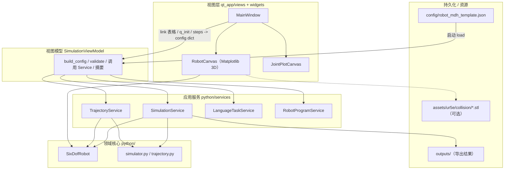
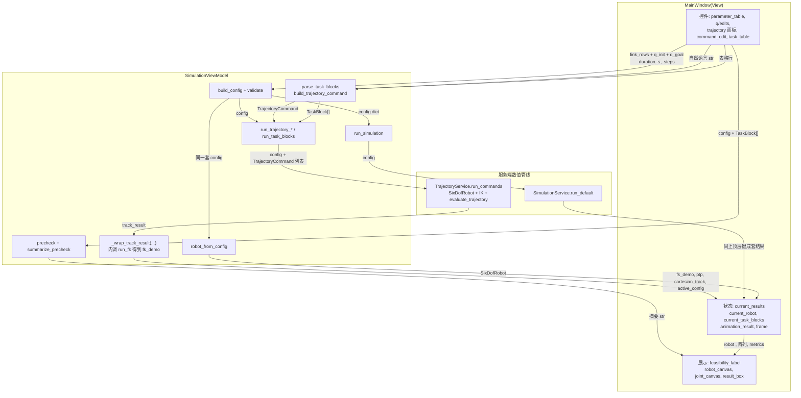
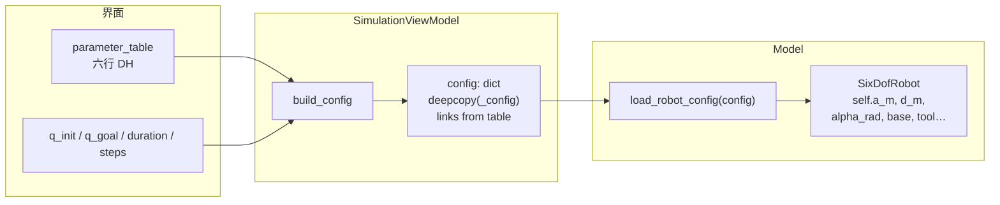
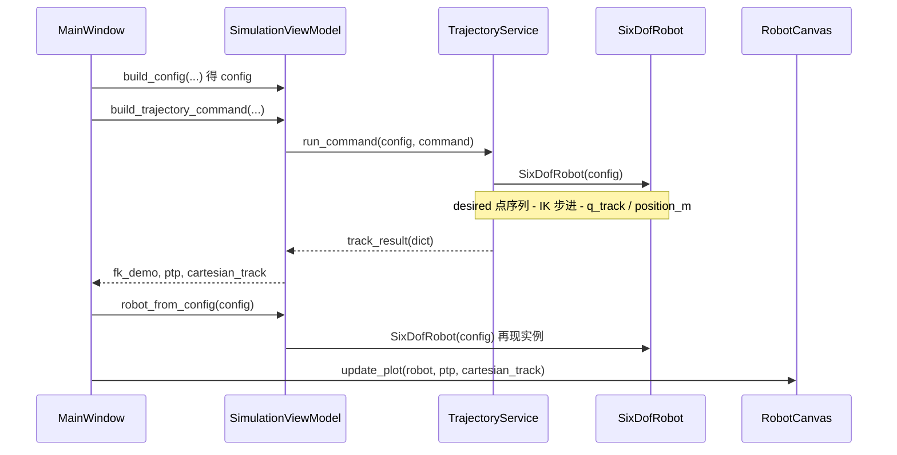
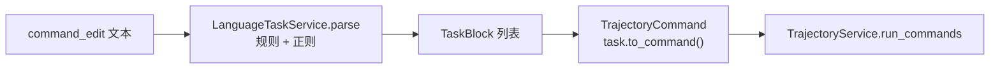

# 六自由度机械臂仿真软件 · 架构与数据流（可视化）

与 **`docs/software_architecture_visual.html`** 内容对应：在 **VS Code / Cursor** 安装 Mermaid 预览插件后打开本文件可看图；或直接 **双击 HTML**（需联网加载 Mermaid CDN）在浏览器中查看。

各模块函数与职责的完整说明：**[`docs/function_reference.md`](function_reference.md)**

详见文字版分层说明：`docs/app_mvvm_architecture.md`。

---

## 1. 分层总架构

---

## 2. 完整变量与数据传递（View / ViewModel / Model）

本节把 **控件读数 → ViewModel → Service / SixDofRobot → 画布与文本** 上的实际变量名与字典键集中说明；对齐 `MainWindow._build_active_config`、`_wrap_track_result`、`TrajectoryService.run_commands`。

### 2.1 View 层：`MainWindow` 与数据流相关的状态

| 成员 / 控件 | 类型或产出 | 作用 |
|-------------|-------------|------|
| `viewmodel` | `SimulationViewModel` | Qt 视图与 ViewModel 的分界 |
| `parameter_table`（行收集） | 表格 → `list[dict]` | `_collect_link_rows` → `build_config(..., link_rows, ...)` |
| `q_init_edit` / `q_goal_edit` / `duration_edit` / `steps_edit` | 字符串解析为数值 | 写入 `config["default_state"]`、`config["simulation_defaults"]` |
| 轨迹面板（轴、半径、长度等） | 控件值 | `build_trajectory_command` → `TrajectoryCommand` |
| `command_edit` | `str` | `parse_task_blocks`；可行性定时器 |
| `task_table` | 表格 ⇄ `TaskBlock` | `_collect_task_blocks_from_table` → `run_task_blocks` |
| `current_results` | `Optional[dict]` | `fk_demo`、`ptp`、`cartesian_track`、`active_config` |
| `current_robot` | `Optional[SixDofRobot]` | 与画布一致：`robot_from_config(active_config)` |
| `current_task_blocks` | `list` | 与任务表同步 |
| `animation_result` / `animation_frame` | 快照 + 索引 | 播放消费与 `cartesian_track` 同型数组 |
| `feasibility_label` | `QLabel` | `precheck_task_blocks` + `summarize_precheck` |
| `robot_canvas` / `joint_canvas` / `result_box` | 控件 | **消费端**：robot + results |

### 2.2 ViewModel：`SimulationViewModel`「入参 → 出参」

| 方法 | 典型入参 | 返回值要点 | 消费者 |
|------|----------|------------|--------|
| `build_config` | `link_rows`, `q_*`, `duration_s`, `steps` | `config` | validate → `run_*` |
| `validate_config` | `config` | 无（抛错即失败） | 仿真与轨迹 |
| `robot_from_config` | `config` | `SixDofRobot` | `current_robot` |
| `run_simulation` | `config` | `{ fk_demo, ptp, cartesian_track }` + `active_config` | UI |
| `run_trajectory_command` | `config`, `TrajectoryCommand` | `_wrap_track_result`，顶层键同上 | UI |
| `run_task_blocks` | `config`, `TaskBlock[]` | 同上；`cartesian_track` 可含 `task_blocks` | UI |
| `precheck_task_blocks` | `config`, `TaskBlock[]` | `precheck` | `feasibility_label` |
| `parse_task_blocks` | `str` | `TaskBlock[]` | `current_task_blocks` |
| `_wrap_track_result` | `track_result` | 合并 `run_fk` → `fk_demo`；`ptp`/`cartesian_track`/`active_config` | `current_results` |

### 2.3 端到端示意（payload 在箭头上）

### 2.4 `current_results` 顶层键；`cartesian_track`

与 `python/trajectory.evaluate_trajectory`、`trajectory_service.run_commands` 一致；多任务时 ViewModel 在 `cartesian_track` 上追加 `task_blocks`。

**`current_results` 顶层**

| 键 | 说明 |
|----|------|
| `fk_demo` | `SimulationService.run_fk(config)`（轨迹 `_wrap_track_result` 路径） |
| `ptp` | `cartesian_track` 的深拷贝，`summary.trajectory_type` 改写为预览语义 |
| `cartesian_track` | 轨迹主字典：阵列 + `summary` + `metrics` + `precheck` + `commands` 等 |
| `active_config` | 本次运行的 `config` 快照 |

**`cartesian_track` 内（`evaluate_trajectory` + TrajectoryService 增补）**

- **阵列与时间：**`time_s`，`q_rad` / `q_deg`，`position_m`，`desired_position_m`，`rpy_deg`，`transforms`
- **`summary`：**机器人名、`source`、`trajectory_type`、采样数、时间跨度
- **`metrics`：**`max_position_error_m`、`mean_position_error_m`；`ik_failure_count` / `ik_failure_ratio`；`max_jacobian_condition`、`near_singular_count`；关节步长与地面/连杆间隙标量（见 `_joint_motion_metrics`、`_environment_motion_metrics`）
- **命令与诊断：**`precheck`，`commands` / `requested_commands`，`command` / `requested_command`，`segment_diagnostics`
- **多任务：**`task_blocks`（仅 `run_task_blocks`）

---

## 3. `config` 与 `SixDofRobot` 的传递

---

## 4. 单条轨迹指令：时序

---

## 5. 自然语言多段任务

---

## 6. 核心数据形态（报告摘录）

| 变量/类型 | 产生于 | 含义 | 主要消费者 |
|-----------|--------|------|------------|
| `config` | JSON + `build_config` | 整份机器人与仿真默认参数 | `SixDofRobot`、各 Service |
| `SixDofRobot` | `SixDofRobot(config)` | FK / 约束 / Jacobian / IK | TrajectoryService、画布 |
| `TrajectoryCommand` | UI 或 `TaskBlock` | 单段轨迹 | TrajectoryService |
| `TaskBlock` | LanguageService | 解析后的子任务 | `run_task_blocks` |
| `cartesian_track` | `evaluate_trajectory` + TrajectoryService 增补 | 时间序列阵列 + `summary` + `metrics` + `precheck` + `commands` 等 | 3D、播放、导出、误差卡片 |
| `results`（bundle） | `run_simulation` / `_wrap_track_result` | `fk_demo`、`ptp`、`cartesian_track`、`active_config` | `current_results` |

---

## 7. 源码索引

- `python/robot_model.py` — `SixDofRobot`
- `python/services/trajectory_service.py`
- `python/services/language_service.py`
- `qt_app/viewmodels/simulation_viewmodel.py`
- `qt_app/views/main_window.py`
- `qt_app/widgets/robot_canvas.py`、`ur5e_visual_model.py`
