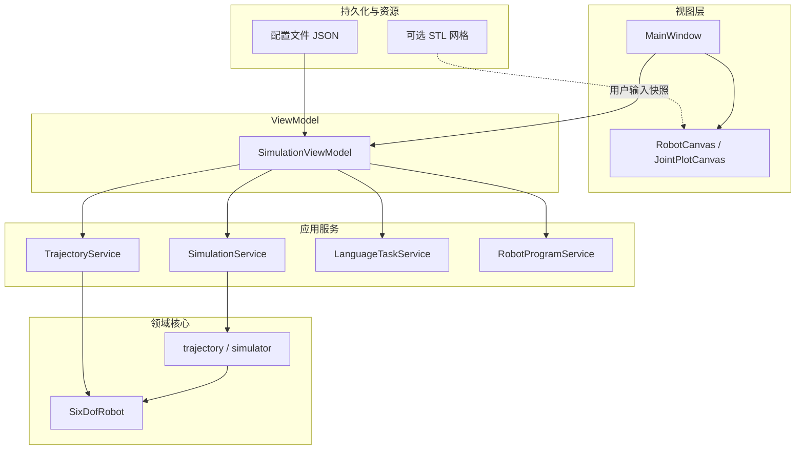

# 六自由度机械臂仿真 Studio：软件设计与构造报告

> **摘要说明**：本文面向课程设计与技术文档撰写需求，系统阐述该仿真软件的构造逻辑、分层架构、研制过程以及 Model、ViewModel、View 之间的数据传递机制。文中出现的模块名与文件名仅便于与源代码对照。正文采用陈述性学术表述；当前正文汉字约六千量级（不计标点及拉丁字符），可按教务要求增补实验记录或接口细则以扩展篇幅。HTML 排版版见同目录 [`studio_design_report.html`](studio_design_report.html)；正文修改后可执行 `python build_studio_report_html.py` 重新生成。

---

# 第一部分：报告提纲

## 1 引言  
## 2 背景与建设目标  
## 3 设计思想与基本原则  
## 4 软件研制过程  
## 5 总体架构  
## 6 Model 层（领域内核与配置）  
## 7 Service 层（应用服务）  
## 8 ViewModel 层  
## 9 View 层（含 STL 三维外观接入）  
## 10 Model — ViewModel — View 数据传递  
## 11 仿真输出数据语义说明  
## 12 演示流程要点、常见问题与架构陈述提要  
## 13 局限性、扩展与安全边界  
## 14 术语与缩写  
## 15 结论  
## 16 参考文献与仓库文档索引  

---

# 第二部分：正文

本部分对软件的设计与数据流作系统性说明。叙述上不依赖源代码细节即可把握层级边界；具体符号名与文件名可与仓库交叉验证。

## 1 引言

本报告旨在说明「六自由度机械臂仿真 Studio」的软件构造方式：在何种需求背景下确立功能边界，如何通过分层架构组织代码与职责，以及用户操作界面与数值内核之间的数据如何在不同场景下生成、校验、传递与呈现。论述以当前仓库实现为依据，必要时指向具体文档与源码路径供复核。

软件以单机桌面应用程序形态交付：人机交互由 Qt（PySide6）实现，三维与二维曲线由嵌入的 Matplotlib 组件绘制；运动学与轨迹相关的数值计算集中于 Python 数值栈（如 NumPy）。机器人几何与仿真默认值主要由 JSON 格式的配置文件描述（例如 `config/` 目录下的模板）；运行时根据界面输入与模板合并生成**本次仿真所使用的完整配置**，下文称为**运行配置**或 **active_config** 所指的对象。

报告后续章节依次交代建设目标、架构选型理由、分层职责、典型数据通路以及输出语义；最后在局限性、术语表与结论中收束。

## 2 背景与建设目标

实体机械臂实验成本高、场地与安全约束多，教学场景中往往需要先在计算环境中建立与参数模型一致的 **数字孪生**，用于验证关节轨迹与末端轨迹规划是否合理，并对跟踪误差等指标进行定量评估。本软件即定位于此类教学与演示用途：在统一参数框架下完成可视化仿真、轨迹构造与结果导出，并为后续控制器接口预留抽象边界。

功能目标可归纳为以下方面。**参数化建模**：支持通过表格编辑连杆几何、关节限位及初始状态等，并与配置文件模板合并。**默认仿真流水线**：在不额外指定自定义轨迹命令的条件下，生成关节空间轨迹与基于模板参数的笛卡尔轨迹，并对二者分别评估。**自定义轨迹**：支持直线、圆弧、空间螺旋等几何类型的离散末端路径生成及逆运动学跟踪。**多块任务**：基于离线规则的自然语言解析生成结构化任务序列，可在表格中编辑后联动执行。**可视化**：三维展示机械臂姿态与轨迹，二维展示关节角随时间变化。**导出与虚拟下发**：将离散轨迹与诊断信息导出为文件；通过接口适配层模拟控制器接收流程而不连接真实硬件。

上述目标决定了界面逻辑与数值内核必须分离：前者承担输入采集与结果呈现，后者承担几何建模、轨迹生成与一致性评测；二者之间通过明确的中间层完成参数拼装与服务编排。

## 3 设计思想与基本原则

### 3.1 分层架构与 MVVM 范式

将全部业务逻辑耦合于单一界面模块将导致修改成本高、职责边界模糊且不利于自动化测试与脚本复用。本项目的实现遵循 **MVVM（Model–View–ViewModel）** 的基本分工：**View** 仅负责控件布局与用户交互；**ViewModel** 负责运行配置的拼装与合法性校验，并调用应用服务完成用例；**Model** 在此泛指领域层的几何模型与轨迹评测模块（及部分离线编排脚本）；介于二者之间的 **Application Service** 将多条底层调用封装为完整的业务场景接口。

从软件工程角度看，该范式的收益可具体化为三点。第一，**可测试性**：运动学与轨迹评测可在无事件循环的环境中以固定配置重复执行，便于回归与对标。第二，**可维护性**：界面样式与布局调整不应扩散到数值稳定性敏感代码路径。第三，**可演化性**：当逆解策略、工作空间离散策略或导出格式升级时，只要服务层对外契约保持后向兼容或版本化迁移路径明确，界面绑定代码的修改面即可控制。该分工的实际效果是：数值内核可在无图形环境下独立运行；界面迭代不应迫使运动学实现频繁改动；算法或服务替换时，只要对外数据结构保持稳定，上层绑定代码面即可收缩。

### 3.2 关注点分离的具体约束

View 不应直接持久化业务配置或嵌入逆解迭代逻辑；ViewModel 不应依赖具体控件类型或样式细节；Service 不应反向操纵界面状态；Model 不应依赖 Qt 等 GUI 框架。跨层传递采用**深拷贝的配置快照**与**统一的轨迹评测结果字典结构**，以降低「界面编辑意外覆盖最近一次仿真基准」一类状态错误的发生概率。此外，界面在参数频繁变更场景下采用防抖合并刷新策略，以减少对正运动学预览的冗余调用；该策略属于人机工程与性能折中，不改变业务语义的单一真源仍在 ViewModel 与 Service 侧的配置与评测结果中定义。

### 3.3 离线可复现的任务解析

自然语言任务解析采用基于规则与正则表达式的确定性方法，在同一输入下产生稳定输出，便于实验记录与课程报告复现。其表达能力受规则覆盖范围限制，与基于大模型的语义理解系统在功能定位上不同。选择该路线的直接动因包括：教学环境网络条件不可控、可复现性优先于语义覆盖广度、以及对输出结构（**TaskBlock**）的强类型约束需求。

## 4 软件研制过程

研制过程大致按以下顺序推进。首先依据用户典型操作序列划分信息架构：参数编辑、可选预览、仿真执行、结果审阅、多块任务编排与导出。其次实现不依赖图形界面的领域内核，包括机器人正逆运动学、关节与笛卡尔轨迹生成、轨迹评测等，并保证可通过命令行或脚本驱动。随后在领域层之上建立应用服务模块，将「默认仿真」「轨迹跟踪与预检」「语言解析」「程序导出」等场景封装为稳定 API。再实现 **SimulationViewModel**，集中处理 **build_config**、**validate_config**、结果摘要与导出委托。最后完成主窗口与绘图控件的接线，补充全局样式与可选 STL 可视化资源，并撰写架构与接口说明文档。

上述顺序体现「自内向外」的集成策略：先验收数值正确性与接口稳定性，再叠加交互与展示层。该策略有助于在课程周期内及早发现模型与配置契约问题，避免将错误延迟到图形栈联调阶段才暴露。

## 5 总体架构

### 5.1 逻辑依赖关系

下图概括自用户界面向下的典型调用方向：持久化资源为 ViewModel 提供初始模板；View 将用户输入提交给 ViewModel；ViewModel 根据场景调用相应 Service；Service 调用领域内核中的 **SixDofRobot** 与轨迹评测逻辑；三维组件可选读取 STL 资源以增强显示，但不改变数值结果。

用文字归纳：界面将当前参数交由 **SimulationViewModel**；默认仿真路径经 **SimulationService** 调用 **simulator** 与 **trajectory** 等模块；自定义与多段轨迹路径经 **TrajectoryService** 完成工作空间评估、离散点生成、逆解跟踪及 **evaluate_trajectory** 评测；**LanguageTaskService** 负责任务文本到 **TaskBlock** 的转换；**RobotProgramService** 将仿真输出整理为可供后续控制器适配的程序描述；**SixDofRobot** 为上述数值过程提供一致的几何与运动学语义。图中 STL 仅占 View 绘制路径且不改变 FK/IK 结果；STL 与各连杆坐标系的挂载方式详见第 **9.1** 节。

### 5.2 与源码目录的对应关系

数值与用例实现主要位于 **`python/`**；界面实现主要位于 **`qt_app/`**；配置与可选网格资源位于 **`config/`**、**`assets/`**；脚本工具位于 **`scripts/`**。函数级索引见 **`docs/function_reference.md`**。

## 6 Model 层：配置真源与数值内核

运行配置由磁盘模板与界面输入合并而成，内容包括连杆几何参数（如 Modified DH / Standard DH 约定下的长度与转角）、基座与工具变换、关节限位、起始与目标关节角、仿真时间与离散点数、环境与净空相关约束字段等。启动时载入模板后在内存中复制并覆写，可避免污染原始配置文件。配置中还承载单位约定（例如长度字段按米或毫米解析），模型初始化阶段据此统一尺度，以保证后续 FK、IK 与工作空间离散在同一度量下闭合。

**SixDofRobot** 基于配置实例化后提供正运动学、数值雅可比、全位姿与位置优先逆运动学等运算，并可依据环境字段计算与地面高度、连杆间距相关的标量指标，供轨迹服务写入诊断结果。具体而言，正运动学沿连杆链累积齐次变换并得到末端执行器位姿；逆运动学以阻尼最小二乘迭代逼近目标；数值雅可比用于构造末端误差对关节变量的局部线性近似，从而支撑轨迹跟踪中的增量修正。关节限位以区间裁剪形式施加于迭代中间变量，以减少无效搜索区域。**evaluate_trajectory** 在时间离散采样上对给定关节轨迹执行正运动学，形成包含末端位置、期望位置（若给定）、误差度量 **metrics**、**summary** 等键的结构化字典，构成上层模块与可视化组件所共享的**评测结果范式**。领域模块不包含 GUI 依赖，从而支持离线批处理与自动化校验。**trajectory** 模块还提供关节空间插补、模板化笛卡尔圆路径生成及其 IK 跟踪失败时的参照轨迹回退逻辑；**simulator** 模块将默认流水线编排为成套输出并可选写盘。

## 7 Service 层：面向场景的服务封装

**SimulationService** 将默认仿真（关节轨迹与模板笛卡尔轨迹的并行生成及评测）、静态 FK 演示与结果导出封装为与界面无关的接口。**TrajectoryService** 负责基于 **TrajectoryCommand** 序列的几何离散、起点姿态与工作空间预检、分段逆解跟踪及指标聚合；其在 **evaluate_trajectory** 输出基础上补充 IK 失败统计、雅可比条件数相关统计、关节步长与环境几何指标等。执行路径上，服务首先在配置约束下选取或修正起始关节配置，对工作空间采样图或启发式半径进行可达性估计并生成 **precheck**；随后对各命令在给定离散分辨率下生成末端位置序列并以迭代 IK 跟踪关节序列；最后拼接时间轴调用统一评测函数并写入命令溯源字段。**LanguageTaskService** 将受限格式的自然语言解析为 **TaskBlock** 列表，并可进一步转换为轨迹命令。**RobotProgramService** 将评测字典中的时间与关节、末端序列整理为版本化的 JSON 程序描述；当前控制器仅为 **DryRun** 语义下的签收模拟。**KinematicsService**（若使用）将逆解请求与响应结构化，便于替换底层求解策略而不牵动调用方签名。

将上述步骤集中于 Service，可避免 ViewModel 中出现冗长的过程式编排，并使同一套服务在无 GUI 脚本中复用。服务边界亦便于在课程项目中单独撰写单元测试或基准数据集比对报告。

## 8 ViewModel 层：**SimulationViewModel**

ViewModel 的职责包括三个方面。其一，基于模板配置 **`_config`** 与用户提供的连杆表行、初始与目标关节角向量、仿真时长与步数等，调用 **build_config** 生成运行配置副本并执行 **validate_config**，对连杆数量、限位一致性、向量维度与时间参数等进行校验。其二，根据用户选择的场景调用 **run_simulation**、**run_trajectory_command**、**run_task_blocks** 或 **precheck_task_blocks** 等入口；其中轨迹相关路径在得到 **TrajectoryService** 返回后由 **_wrap_track_result** 与默认仿真路径对齐外层键集合（含 **fk_demo**、**ptp**、**cartesian_track**、**active_config**），以降低 View 侧分支复杂度。其三，提供 **summarize_results**、**assess_results** 等方法，将评测字典中的数值摘要为可读文本与分级评估结果，供界面文本框与状态呈现使用。

值得强调的是，**_wrap_track_result** 的工程意图在于：即便默认仿真与自定义轨迹在内部管线长度与中间变量上存在差异，界面仍可对「最近一次成套输出」采用统一的字段访问约定；该约定直接降低了 **MainWindow** 中条件分支数量，并使导出与绘图模块能够以同一 schema 解析。

## 9 View 层：主窗口、绘图组件与 STL 三维外观

主窗口 **MainWindow** 集成参数表格、仿真与轨迹控件、自然语言输入与任务表格、三维画布 **RobotCanvas**、关节曲线画布 **JointPlotCanvas**、误差指标卡片与结果文本区等。界面侧维护 **current_results**（最近一次完整仿真返回字典）、**current_robot**（与当前配置一致的 **SixDofRobot** 实例）、**current_task_blocks**（解析或表格同步的任务列表）以及播放相关的帧索引状态；绘图控件消费标准化评测字典中的数组字段与机器人实例完成绘制，不向 ViewModel 回写数值结果。

参数表格变更后可经防抖定时触发仅含正运动学的预览刷新；完整仿真成功后更新全套缓存并驱动多维可视化组件联动刷新。界面异常处理路径以捕获 ViewModel 抛出的校验异常为主，并向用户给出可读的错误描述；该策略避免在 View 层复制校验规则从而造成双份维护。

### 9.1 三维 STL 模型如何接入软件并完成装配

本项目的「机械臂本体」在数值上始终由配置文件与 **SixDofRobot** 描述（连杆 DH、复合底座可选、末端偏置与关节限位等）；三维画布中的 **实心外观**可选用 Universal Robots **UR5e 碰撞 STL**（三角网格），与上述数值模型为**并联关系**：网格只增强 **RobotCanvas（Matplotlib 3D）** 的观感，**不参与正逆解、轨迹生成与评测**。若 STL 不可用或机型配置不要求 UR5e 外观，则自动退回连杆折线 / 圆柱体简化骨架绘制，整条仿真流水线仍可运行。

**资源落盘与发现路径。** 运行时默认期望在仓库根目录下存在目录 `assets/ur5e/collision/`，并按固定文件名提供七段 STL（`base.stl`、`shoulder.stl`、`upperarm.stl`、`forearm.stl`、`wrist1.stl`、`wrist2.stl`、`wrist3.stl`）。为方便版权与体积管理，网格文件一般不随仓库一并提交；本地可通过脚本 `scripts/download_ur5e_meshes.py` 从公开的 ROS2 描述包镜像拉取同款碰撞网格（需在合规网络环境与许可前提下使用）。

**配置文件中的可视化开关。** 在 `config/robot_mdh_template.json`（或运行时合并得到的 active_config）中，`visual_model` 小节声明外观类型与目录：`type` 为 `"ur5e"` 时表示启用 UR5e 专用装配管线；`mesh_dir`（如 `"assets/ur5e/collision"`）指明 STL 查找路径。**SimulationViewModel** 与数值 Service 不负责解析 STL；仅从配置实例化机器人后传给 View，由 **RobotCanvas** 持有的 **UR5eVisualModel** 读取。

**画布内的接入方式。** **RobotCanvas** 在构造函数中常驻实例化 **`UR5eVisualModel`**。绘制单帧机体时，`_draw_visual_or_solid_robot` 调用 `UR5eVisualModel.draw(...)`：**仅当** `supports(robot)`（配置中为 ur5e 外观）且 `is_available()`（七文件齐全）**同时成立**才把各 STL 顶点变换到世界系并添加到 `Axes3D`。否则同一入口回落到 **`_draw_solid_robot`**，用圆柱/球近似连杆与关节。**`_display_geometry`**、运动拖影 **`_draw_motion_sweep`** 与播放 **`update_frame`** 等路径同样在「支持 + 网格齐套」时使用 `link_polyline` / `joint_markers_with_tcp` 等与 STL 对齐的连杆折线取样点；否则沿用 **SixDofRobot** 的 `joint_positions_display` 与模型侧关节语义，以保持轨迹与占位几何一致。

**装配（链路级）如何实现。** STL 自带的坐标系与各连杆 FK 帧并不天然重合，因而在 **`qt_app/widgets/ur5e_visual_model.py`** 中采用两层变换保证「看起来像一整台串联臂」且不依赖完整 URDF 解析器：  
其一，**相邻连杆链路** **`_ur5e_link_frames`** 使用与 UR **官方相邻连杆 kinematics** 一致的**固定父子齐次变换**序列，并在每一关节处右乘绕局部 **Z** 的转动 `qᵢ`（再乘 **SixDofRobot.base**），得到从底座到法兰的七级连杆帧 `T_0`…`T_6`，运动时相邻零件不会因缺少固定偏置而散架。  
其二，**STL 文件名级绑定**常量 **`UR5E_COLLISION_BINDINGS`**：每一段网格指定挂载的 **`frame_index`**（对应上述链路中的一帧）以及在连杆坐标系内的 **`local_xyz` / `local_rpy`** 微调，使官方碰撞网格的视觉原点与连杆几何轴对齐关系满足教学演示观感。对单个三角顶点矢量 `v`，先在连杆系下乘局部位姿，再经对应连杆帧变换到世界系（实现中等价于先用 `T_frame_index @ T_local` 作用在 STL 顶点上）。其后经 **`Poly3DCollection`** 着色绘制；对 STL 法向可能正反不一的情况采用**双侧光照**，减轻暗缝；解析得到的三角网在进程内可做缓存，以降低播放 scrub 时的磁盘读取。

**小结。** 综上，「接入」体现在磁盘资源与 `visual_model` 配置；「装配」体现在代码里 UR 风格的**相邻链路 FK** 与 **`MeshBinding` 局部外参** 的合成。该路径仅限当前实现的 UR5e 外观套件；扩展到其它商的 STL 时需另设绑定表与链路构造函数，并保持与 DH 内核在 TCP 语义上的一致性说明。

## 10 Model — ViewModel — View 数据传递

本章归纳若干典型数据通路。各通路共用原则为：**主数据流由界面经 ViewModel、Service 指向领域内核，再以结构化评测字典返回界面**；异常由 ViewModel 抛出并由界面捕获提示；完整仿真路径附带配置快照以保证实验条件可追溯。

**预览通路**：界面读取连杆表与初始关节角文本，经 **build_config** 得到运行配置后实例化 **SixDofRobot**，对初始关节角执行正运动学并在画布显示静态姿态。该路径一般不更新 **current_results**，但刷新 **current_robot**，以便后续绘图与其它通路共享同一几何实例。预览不产生沿时间的误差统计，因此误差卡片与概要文本不应被视为已由该路径刷新。

**默认仿真通路**：界面组装运行配置后调用 **run_simulation**。ViewModel 执行校验后经 **SimulationService** 编排默认流水线：生成关节空间轨迹及其评测结果，生成依据仿真默认值定义的笛卡尔轨迹及其评测结果，并附带静态 FK 摘要字段；最终将本次生效配置写入 **active_config**。界面将返回字典保存为 **current_results**，依据 **active_config** 重建机器人实例，调用三维画布绘制 **ptp** 与 **cartesian_track** 所含轨迹信息，并以 **cartesian_track** 为主驱动关节曲线与文本概要组件。

**单条自定义轨迹通路**：界面汇总轨迹类型与几何参数（必要时叠加简短文本解析），构造 **TrajectoryCommand** 并调用 **run_trajectory_command**。**TrajectoryService** 返回轨迹评测字典后，由 **_wrap_track_result** 注入 **fk_demo**、构造与轨迹语义对齐的 **ptp** 副本字段（用于界面并列对比语义）、保留原始轨迹结果为 **cartesian_track**，并写入 **active_config**。界面随后的绑定步骤与默认仿真通路一致，从而减少分支逻辑。

**多块任务与预检通路**：界面维护 **TaskBlock** 列表及其与自然语言解析结果的同步。可行性检查通过 **precheck_task_blocks** 得到 **precheck** 数据结构，经摘要函数转为可读字符串呈现；该步骤不要求完成整条轨迹 IK。**run_task_blocks** 将任务序列转换为命令序列并调用 **TrajectoryService.run_commands**，在评测字典中附加任务快照字段便于导出核对。界面更新逻辑仍遵循统一外层键集合。

**播放通路**：播放器仅在界面局部维护帧索引，从已缓存评测字典的时间序列字段读取对应样本并调用 **update_frame**；不在此处重复调用 Service，以保证 scrub 操作的响应性与确定性。

**导出与虚拟下发通路**：导出调用将路径参数下传至 ViewModel，由其委托 **SimulationService.export_results_bundle** 或 **RobotProgramService.export_program** 等接口完成写盘；虚拟下发仅生成签收描述信息，不涉及电气接口。

上述通路体现了配置对象、轨迹命令对象、任务块列表与成套评测字典四类核心载体在不同层级间的传递顺序；详细字段级说明见 **`docs/software_architecture_visual.md`** 第 2 节。

## 11 仿真输出数据语义说明

评测字典中与时间对齐的数组通常包含 **time_s**、**q_rad** / **q_deg**、末端位置 **position_m**、规划末端位置 **desired_position_m**（若适用）、姿态 **rpy_deg**、齐次变换序列 **transforms** 等。**summary** 描述数据来源、轨迹类型标识与采样规模。**metrics** 聚合位置误差的最大值与均值，轨迹服务路径下还可包含 IK 失败计数与比例、雅可比条件数统计、关节步长统计以及环境与净空相关标量。**precheck** 承载执行前的风险评估与尺度建议。**commands**、**requested_commands**、**segment_diagnostics** 等字段记录命令参数与分段诊断信息；多块任务执行时还可能包含 **task_blocks** 快照以便导出与复核。

从数据建模角度看，上述字段共同构成「离散时间–关节–末端」三重索引下的实验记录：**time_s** 提供统一时间参数化；**q_*** 给出关节空间轨迹；**position_m** 与 **desired_position_m** 给出任务空间跟踪误差定义所需的配对序列；**metrics** 则是在整条轨迹上聚合后的标量指标，用于界面 KPI 卡片与导出 JSON 的诊断段落。**precheck** 与 **commands** 类字段则为事后追溯「输入几何是否被缩放或改写」提供文本化与结构化证据。

## 12 演示流程要点、常见问题与架构陈述提要

课程演示可按下列顺序组织陈述而不依赖源代码细节：说明参数来源于 JSON 模板与内存合并机制；演示参数变更后的静态姿态预览与完整仿真的区别；执行默认仿真并解读关节曲线与误差指标；切换到自定义轨迹命令并强调结果外层结构与默认仿真的一致性设计动机；演示自然语言解析的任务表编辑与整块执行；通过播放控件展示对已生成离散结果的索引访问；最后展示导出文件与虚拟签收流程并重申其与真实驱动的分界。

使用过程中若出现无明显界面响应，应优先检视参数校验错误提示（仿真时长非正、步数过小、关节限位倒置等）。末端轨迹出现较大跟踪误差或折返时，应结合 **metrics** 中的 IK 失败与雅可比条件数信息分析是否与奇异位形或步长过大相关。自然语言解析失败通常源于表达方式超出规则覆盖范围，需在报告中如实记录输入样例与系统响应。孪生与实物机器人的差异主要来自摩擦、减速器间隙、控制周期与安全链路等未建模因素，应在结论或局限性中予以说明。STL 缺失时系统仍可依赖骨架几何完成数值评测与导出。

架构答辩时可强调的是：四层分工（View / ViewModel / Service / Model）、轨迹评测字典范式统一、**_wrap_track_result** 对不同仿真入口 outer schema 的对齐作用、离线确定性解析的定位，以及导出与 DryRun 的非实物闭环性质。

## 13 局限性、扩展与安全边界

自然语言解析基于规则与正则表达式的模式集合，覆盖面有限，不具备通用开放域语义对话能力。逆运动学采用阻尼迭代类数值方法，收敛性与精度受初值与奇异位形影响；轨迹服务虽含尺度与工作空间预检，但不能从理论上保证全域跟踪成功。STL 可视化主要用于外观呈现与教学观感，不构成高精度碰撞检测或干涉检查的替代实现。导出 JSON 及 DryRun 签收不构成工业场景下的功能安全认证；连接真实硬件前须另行实现急停、限速、工具坐标标定与安全互锁等措施，并通过 **RobotController** 协议接入，同时对仿真坐标与控制周期进行一致性验证。

## 14 术语与缩写

下列术语在本文及配套技术文档中具有约定含义。**JSON**：基于文本的结构化数据交换格式，常用于机器人与仿真参数存档。**FK（Forward Kinematics）**：由已知关节变量计算末端执行器位姿。**IK（Inverse Kinematics）**：在给定末端位姿或位置约束下求解关节变量。**PTP**：关节空间中以起止关节配置为主、不强调末端几何路径形态的插补类别。**Jacobian**：描述关节空间无穷小位移与末端任务空间误差一阶近似之间线性映射的矩阵。**metrics**：轨迹评测字典中用于聚合误差与其它诊断量的数值字段集合。**precheck**：轨迹执行前基于工作空间离散或启发式估计形成的风险评估数据结构。**DryRun**：不向物理控制器下发实质功率或运动的签收模拟。**MVVM**：将视图、视图模型与模型分层组织的架构范式。**STL**：立体三角网格文件格式，用于三维可视化网格载入。

## 15 结论

本仿真软件面向教学场景下的机械臂轨迹验证需求，采用 MVVM 分层结构组织界面、视图模型、应用服务与领域内核；通过统一的轨迹评测字典与 **TrajectoryService** / **SimulationService** 的服务封装，实现默认仿真与自定义轨迹两类入口在界面消费侧的结构对齐。数据传递路径涵盖预览、默认仿真、自定义轨迹、多块任务及预检、播放索引访问以及导出与虚拟签收等环节，均在配置快照与异常上浮机制约束下运行。局限性主要体现在解析覆盖范围、数值 IK 收敛性及未建模的机电与安全环节；后续可在保持接口边界的前提下替换求解算法或接入实体控制器。

## 16 参考文献与仓库文档索引

| 文档 | 说明 |
|------|------|
| `docs/software_architecture_visual.md`（或 `.html`） | Mermaid 图示与变量、字典键对照 |
| `docs/function_reference.md` | 函数与类方法索引 |
| `docs/app_mvvm_architecture.md` | MVVM 简述与硬件扩展提示 |

---

*正文结束。排版可选用 Markdown、HTML 或经 Pandoc 转换为 DOCX。*
